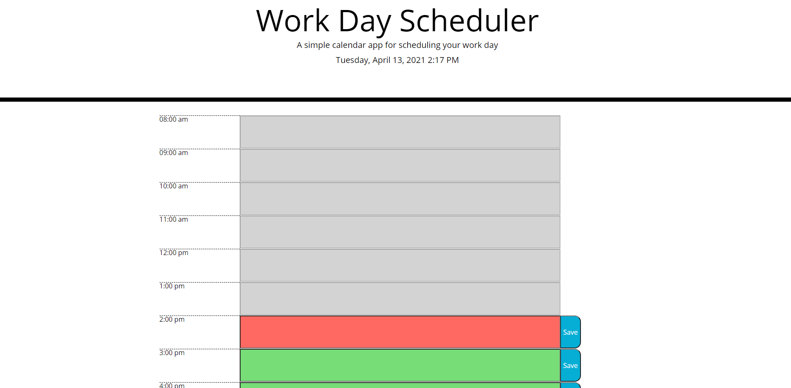

My Day Planner.
An application that allows a user to see the events for their day.

The application allows a user to see the events that they have for the current day. 
Depending on whether the start time for the event is in the past, present or future of the current hour, the color of the event text background
will be different.  
For past events the background will be grey, for the present the background will be red and for future events
the background will be green.
Users are able to add, change or delete event text if the event start time is either present or in the future.  Event text for past events cannot be changed.

To save the event to the users local storage, the user simply clicks on the Save button next to the event.
To remove text, the user simply deletes the text and clicks on the save button.

When adding a new event and the user doesn't enter any text they will be presented with a confirmation prompt advising them to enter
some event text.

